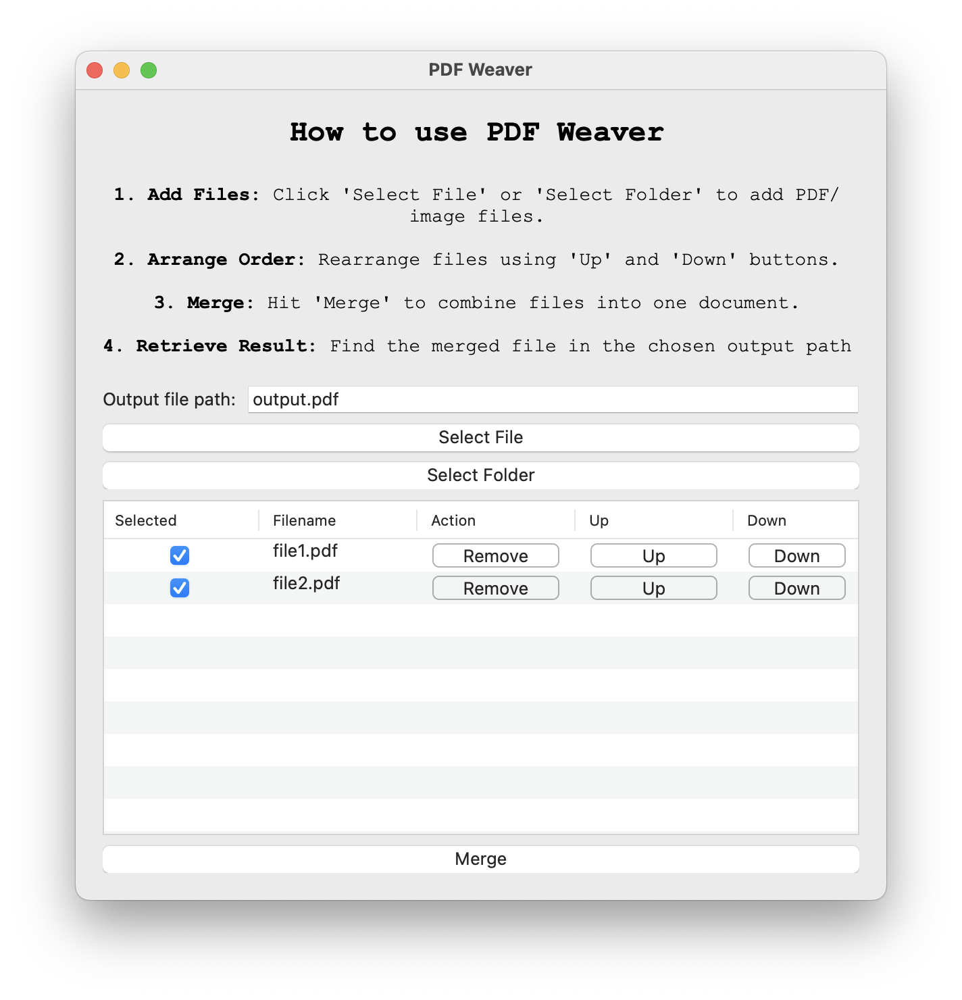
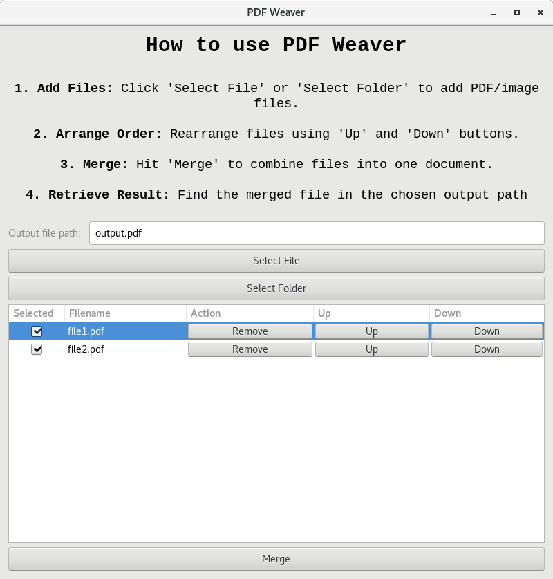

# PDF Weaver - simple GUI to merge PDF files

PDF Weaver is a simple, multi-platform tool to merge any PDF or image (coming soon) files into a singe document. User can choose the order of merging.

Stop trusting remote services with your sensitive files, use open-source, offline software to handle your PDF merging needs.

Built with Ruby and [Glimmer DSL for LibUI](https://github.com/AndyObtiva/glimmer-dsl-libui).

## Usage instructions
In order to install dependencies and run the program use:
```
bundle install
bundle exec ruby pdf_weaver.rb
```
Or if a proper ruby environment is in place you can just run:
```
./pdf_weaver.rb
```
Then follow instructions on the screen.
## Screenshots

### Mac


### Linux


<!-- TODO -->
<!-- | Windows | Mac | Linux |
|:---:|:-----:|:-------:|
|||| -->